# Private AI on a Budget: Multi-Functional LLMs on a 4GB RTX 3050

With recent advancements in AI research, we can ~~dream of running~~ actually run a private AI on our own machines, avoiding data sharing and token fees. The results are not 100% perfect but astonishingly capable for day to day tasks.

Following is the architecture diagram of the project, drawn by the Local AI itself:


In this post, I will break down step by step how I achieved working local AI using a single NVIDIA RTX 3050 Laptop GPU with 4 GB VRAM; and how you can too.

## The Requirements

Before starting any project, it is crucial to set realistic goals. Running a full local stack on entry-level hardware meant striking a balance between utility and resource constraints. 

My target requirements for this setup were:

* **Concurrent Usage:** Support for 2–4 local users on the LAN
* **Image Generation:** 15–20 generations per week
* **Language Support:** Multi-lingual capabilities
* **Real-Time Data:** Live web search integration
* **Use Cases:** Recipe and travel planning assistance
* **Vision:** Image analysis and multimodal understanding
* **Development:** Minor coding assistance
* **Accessibility:** Fully LAN accessible across home devices
* **Privacy & Cost:** 100% offline — zero cloud dependencies or token fees

## 🛠️ The Specs & Constraints

- **Hardware:** RTX 3050 (4 GB VRAM), 16 GB System RAM.
- **Target Load:** 2–4 concurrent local users on private home network.
- **Features:** LLM reasoning, self-hosted web search (SearXNG), reverse geocoding, and image generation/editing (ComfyUI).
- **Core Challenge:** 4 GB VRAM is not enough memory to keep an LLM and a Diffusion model loaded at the same time.

## Prerequisite

This solution works on the back of three major giants which you must setup beforehand --

1. [`llama.cpp`](https://github.com/ggml-org/llama.cpp) - Follow the instruction on their page and get ready
2. [`ComfyUI`](https://github.com/comfy-org/comfyui) - It's just one `pip install` away. Just the simple server is more than enough, you won't need anything else.
3. [`SearXNG`](https://github.com/searxng/searxng) - One `docker` container installation and enabling `json` format is required, which you can find in their guide
4. [`Nginx`](https://nginx.org/) - **Optional**

## TL;DR

If you are running short of time and want to quickly get ready, you can follow this link - [Local AI](https://github.com/Palash90/local-ai).

## 🏗️ High-Level System Architecture

The whole stack runs locally on the dev machine. I hosted the orchestrator (`chat-webui.py`) with an `Nginx`. The orchestrator in turn connects to three backbone servers - `llama.cpp`, `ComfyUI` and `SearXNG`

```text
LAN Devices ---> Nginx (chat.local) ---> chat-webui.py (Port 3001)
                                            │
               ┌────────────────────────────┼────────────────────────────┐
               ▼                            ▼                            ▼
      llama-server (8081)           ComfyUI (8188)             SearXNG Docker (8080)
      (LLM Inference)            (Image Generation)            (Privacy Web Search)

```

## The Challenges

If my machine could, it would revolt against me. The system was never designed to surf through a server load, even if it was for a single user. Still, I forced it to. Of course, there were consequences:

- The system has severe hardware limits in terms of running AI
- To run anything meaningful at its full version, you need at least 8 GB VRAM
- When you use the VRAM fully for llm inference, you don't have memory to spare for image generation
- Continuous use of GPU during a chat session caused the machine to go beyond its thermal design
- Continuous use of LLM slowly creeped up System RAM, forcing full reboot of the system
- Abrupt system failure, OOM crash, Sudden halts

## Engineering Solutions

### 1. Finding a usable model

The biggest problem of running a usable llm model was already solved by all the beautiful minds working towards pushing Edge AI solutions. I just had to choose models which does not overshoot my memory to load the model and it's related dependencies on later. I tried a few and ran them on local for quite few days, before finally sticking to `Gemma4 E2B IT`.

Keeping all my requirements in mind, I had tried the following --

1. **Qwen3.5 9B** - Very good but very slow on my machine because of CPU/GPU split.
2. **Qwen3 VL 4B** - It was working fine with a reasonable speed but had been reasoning too much eating up time. Had to discard it.
3. **Gemma4 E4B** - Same problem, was working fine but was too slow for day to day conversations.
4. **Gemma4 E2B IT** - This is working reasonably well with quite good speed (35 to 45 tokens/second), has native multi-lingual support and does some basic reasoning.

For image generation also, I switched back and forth between different models:

1. **Realistic** - Was very fast but not accurate
2. **SD 1.5** - Not accurate images but very fast
3. **SD 3.5** - Most of the generated image had a synthetic feel
4. **Z-Image-Turbo** - Fits VRAM budget, generates decent images, Img2Img flow is also supported.
    _Note:_ Img2Img workflow does not work pretty well on actual photos yet but editing an existing image works fine. e.g. I asked it to draw a cat and then recolor it from black and white to Brown and White, it works that way reasonably well.

### 2. Dynamic VRAM Swapping & State Machine

Since both `llama-server` and `ComfyUI` cannot share 4 GB VRAM concurrently without crashing, I built an automated state machine inside the backend orchestrator:

1. When a user requests an image, the backend intercepts the tool call.
2. It sends an unload call to `llama-server` to completely free GPU VRAM.
3. `ComfyUI` executes the generation workflow using `--lowvram` mode.
4. Once completed, VRAM is cleared and the LLM is automatically reloaded into GPU memory.
5. The LLM checks for next task if it has any and then sends the response back

### 3. Thermal Monitoring & RAM Evacuation Loop

There is a differnece between showing something on demo and a system failing in production on Tuesday afternoon.

With above mentioned two steps, the whole system will become demo ready but, if you want to run it 24/7, you need to plan for system health. For me, it needed me to have two special cares:

1. **Thermal Loop:** A background daemon polls `nvidia-smi` every 10 seconds. If GPU temperature hits **85°C**, active models are unloaded until the temparature drops below **65°C**.
1. **RAM Evacuation:** If system RAM usage reaches **95%**, ongoing tasks are safely re-queued, services are restarted, and memory is flushed before resuming.

Now, it shows a message on the UI for the warning of thermal overhead or RAM overload. This is exactly where, you should be aware of your user base. If you have massive user base, you can't pull this trick.

### 4. Tool Calling & Multi-Tenant Queue

At first, you might look at the `python` implementation and call me out, in the era of `FastAPI`, you are still using single threaded queues.

But, here is why it needs to be part of the design, if I unbound users to run multiple queries at once, I had to spawn new LLM Inference threads (a standard in tools like `ollama`) for each of those queries. On top of it, if one or two requests within those requests had an image generation, my server would crash immediately. 

So, I block the users on having multiple requests at one by:

* `_llm_pool` (1 Worker): Enforces strict single-LLM inference to prevent memory thrashing.
* `_tool_pool` (2 Workers): Handles parallel tool calls like running `SearXNG` queries or reverse geocoding via Nominatim simultaneously.

---

## 🚀 How to Launch the Stack

1. **Start `llama-server` (CUDA enabled):**

```bash
~/local-ai/llama.cpp/build/bin/llama-server \
    --host 0.0.0.0 --port 8081 \
    --models-dir ~/local-ai-files/my-models/ \
    --n-gpu-layers 99 --ctx-size 32768 -ctk q8_0 -ctv q8_0 -fa on

```

1. **Start ComfyUI in Low-VRAM mode:**

```bash
cd ~/local-ai/ComfyUI && source venv/bin/activate
python main.py --lowvram

```

1. **Launch the Orchestration WebUI:**

```bash
cd ~/git/local-ai && python chat-webui.py

```

For a detailed installation steps and other usage methods please check - [TL;DR](#tldr)

---

## Architecture at a Glance

```mermaid
graph LR
    %% Nodes & Subgraphs
    subgraph Clients ["👥 NETWORK INGRESS"]
        Users["<b>LAN USERS</b><br/>(chat.local / Nginx)"]
    end

    subgraph Backend ["⚙️ PYTHON ORCHESTRATOR (chat-webui.py)"]
        direction TB
        OrchCore["<b>Core Engine</b>"]
        SubEngines["• Queue Engine &nbsp;&nbsp; • Thermal Guard &nbsp;&nbsp; • RAM Evacuator"]
    end

    subgraph ExecutionLayer ["🔄 INFERENCE & TOOL RUNTIMES"]
        LLM["<b>llama-server</b><br/>(LLM Engine)"]
        Swapper["<b>VRAM SWAPPER</b><br/>(State Machine)"]
        Comfy["<b>ComfyUI</b><br/>(--lowvram)"]
    end

    subgraph Hardware ["💻 HARDWARE BOTTLENECK"]
        GPU["<b>NVIDIA RTX 3050</b><br/>(4 GB VRAM Pool)"]
    end

    %% Flow Connections
    Users -->|"HTTP (Port 3001)"| OrchCore
    OrchCore --- SubEngines
    
    SubEngines -->|"LLM Requests"| LLM
    SubEngines -->|"State Triggers"| Swapper
    SubEngines -->|"Image Tasks"| Comfy

    Swapper <-->|"Unload / Reload"| LLM
    Swapper <-->|"Free / Allocate"| Comfy

    LLM -->|"Shared VRAM"| GPU
    Comfy -->|"Shared VRAM"| GPU

    %% Color Styling
    style Clients fill:#1e293b,stroke:#3b82f6,stroke-width:2px,color:#fff
    style Backend fill:#0f172a,stroke:#6366f1,stroke-width:2px,color:#fff
    style ExecutionLayer fill:#111827,stroke:#10b981,stroke-width:2px,color:#fff
    style Hardware fill:#270008,stroke:#f43f5e,stroke-width:2px,color:#fff

    style Users fill:#334155,stroke:none,color:#93c5fd
    style OrchCore fill:#1e1b4b,stroke:none,color:#c7d2fe
    style SubEngines fill:#1e1b4b,stroke:none,color:#e0e7ff
    style LLM fill:#064e3b,stroke:none,color:#a7f3d0
    style Swapper fill:#065f46,stroke:#34d399,stroke-width:1px,color:#ecfdf5
    style Comfy fill:#064e3b,stroke:none,color:#a7f3d0
    style GPU fill:#4c0519,stroke:none,color:#fecdd3

```



---

## Future Scope of Enhancement

The following are a few planned activities. I am not sure when or how I will handle them. But if I achieve these, I will keep you posted.

- Android native app support
- Extend the llm to an agentic work flow
- Working Audio Interface
- Connect to my Private AI using Internet

---

## 💭 Lessons Learned

Squeezing performance out of constrained hardware forces you to think deeply about system limits, concurrency locks, and memory lifetimes. You don't always need massive cloud infrastructure to build powerful tools—sometimes you just need careful resource management.
