# Private AI on a Budget: Multi-Functional LLMs on a 4GB RTX 3050

With the advancement on the AI reasearch field, we can actually ~~dream of running~~ run a private AI on our own machine and avoid sharing our data on cloud and paying for tokens. The results are acceptable (not 100% perfect). Following is the architecture represntation done by the Local AI:


In this post, I will break down step by step what I have achieved with a single NVIDIA RTX 3050 Laptop GPU with 4 GB VRAM only and how you can too.

## The Requirement

Before starting any project, we should set a realistic goal. For me those gols looked like the following:

1. 2–4 concurrent users
1. 15–20 image generations per week
1. Multi-lingual
1. Web search
1. Recipe / travel planning assistance
1. Image analysis (vision models)
1. Minor coding assistance
1. LAN accessible
1. No Cloud dependency

## 🛠️ The Specs & Constraints

- **Hardware:** RTX 3050 (4 GB VRAM), 16 GB System RAM.
- **Target Load:** 2–4 concurrent local users on private home network.
- **Features:** LLM reasoning, self-hosted web search (SearXNG), reverse geocoding, and image generation/editing (ComfyUI).
- **Core Challenge:** 4 GB VRAM is not enough memory to keep an LLM and a Diffusion model loaded at the same time.

## Prerequisite

This solution works on the back of three major giants which you must setup beforehand --

1. [`llama.cpp`](https://github.com/ggml-org/llama.cpp) - Follow the instruction on their page and get ready
2. [`ComfyUI`](https://github.com/comfy-org/comfyui) - It's just one `pip install` away. Just the simple server is more than enough, you won't need anything else.
3. [`SearXNG`](https://github.com/searxng/searxng) - One `docker` container installation and enabling `json` format is required, which you can find in their guide
4. [`Nginx`](https://nginx.org/) - **Optional**

## TL;DR

If you are running short of time and want to quickly get ready, you can follow this link - [Local AI](https://github.com/Palash90/local-ai).

---

## 🏗️ High-Level System Architecture

The whole stack runs locally on the dev machine. I hosted the orchestrator (`chat-webui.py`) with an `Nginx`. The orchestrator in turn connects to three backbone servers - `llama.cpp`, `ComfyUI` and `SearXNG`

```text
LAN Devices ---> Nginx (chat.local) ---> chat-webui.py (Port 3001)
                                            │
               ┌────────────────────────────┼────────────────────────────┐
               ▼                            ▼                            ▼
      llama-server (8081)           ComfyUI (8188)             SearXNG Docker (8080)
      (LLM Inference)            (Image Generation)            (Privacy Web Search)

```

---

## 💡 Key Engineering Solutions

### 1. Dynamic VRAM Swapping & State Machine

Since both `llama-server` and `ComfyUI` cannot share 4 GB VRAM concurrently without crashing, I built an automated state machine inside the backend orchestrator:

1. When a user requests an image, the backend intercepts the tool call.
2. It sends an unload call to `llama-server` to completely free GPU VRAM.
3. `ComfyUI` executes the generation workflow using `--lowvram` mode.
4. Once completed, VRAM is cleared and the LLM is automatically reloaded into GPU memory.

### 2. Thermal Monitoring & RAM Evacuation Loop

Small laptop chassis heat up fast during multi-round reasoning loops. To prevent hardware throttling:

* **Thermal Loop:** A background daemon polls `nvidia-smi` every 10 seconds. If GPU temperature hits **85°C**, active models are unloaded until the temp drops below **65°C**.
* **RAM Evacuation:** If system RAM usage reaches **95%**, ongoing tasks are safely re-queued, services are restarted, and memory is flushed before resuming.

### 3. Tool Calling & Multi-Tenant Queue

The backend manages thread pools for execution safety:

* `_llm_pool` (1 Worker): Enforces strict single-LLM inference to prevent memory thrashing.
* `_tool_pool` (2 Workers): Handles parallel tool calls like running `SearXNG` queries or reverse geocoding via Nominatim simultaneously.

---

## 🚀 How to Launch the Stack

1. **Start `llama-server` (CUDA enabled):**

```bash
~/local-ai/llama.cpp/build/bin/llama-server \
    --host 0.0.0.0 --port 8081 \
    --models-dir ~/local-ai-files/my-models/ \
    --n-gpu-layers 99 --no-kv-offload --ctx-size 32768

```

2. **Start ComfyUI in Low-VRAM mode:**

```bash
cd ~/local-ai/ComfyUI && source venv/bin/activate
python main.py --lowvram

```

3. **Launch the Orchestration WebUI:**

```bash
cd ~/git/local-ai && python chat-webui.py

```

---

## Architecture at a Glance

```mermaid
graph LR
    %% Nodes & Subgraphs
    subgraph Clients ["👥 NETWORK INGRESS"]
        Users["<b>LAN USERS</b><br/>(chat.local / Nginx)"]
    end

    subgraph Backend ["⚙️ PYTHON ORCHESTRATOR (chat-webui.py)"]
        direction TB
        OrchCore["<b>Core Engine</b>"]
        SubEngines["• Queue Engine &nbsp;&nbsp; • Thermal Guard &nbsp;&nbsp; • RAM Evacuator"]
    end

    subgraph ExecutionLayer ["🔄 INFERENCE & TOOL RUNTIMES"]
        LLM["<b>llama-server</b><br/>(LLM Engine)"]
        Swapper["<b>VRAM SWAPPER</b><br/>(State Machine)"]
        Comfy["<b>ComfyUI</b><br/>(--lowvram)"]
    end

    subgraph Hardware ["💻 HARDWARE BOTTLENECK"]
        GPU["<b>NVIDIA RTX 3050</b><br/>(4 GB VRAM Pool)"]
    end

    %% Flow Connections
    Users -->|"HTTP (Port 3001)"| OrchCore
    OrchCore --- SubEngines
    
    SubEngines -->|"LLM Requests"| LLM
    SubEngines -->|"State Triggers"| Swapper
    SubEngines -->|"Image Tasks"| Comfy

    Swapper <-->|"Unload / Reload"| LLM
    Swapper <-->|"Free / Allocate"| Comfy

    LLM -->|"Shared VRAM"| GPU
    Comfy -->|"Shared VRAM"| GPU

    %% Color Styling
    style Clients fill:#1e293b,stroke:#3b82f6,stroke-width:2px,color:#fff
    style Backend fill:#0f172a,stroke:#6366f1,stroke-width:2px,color:#fff
    style ExecutionLayer fill:#111827,stroke:#10b981,stroke-width:2px,color:#fff
    style Hardware fill:#270008,stroke:#f43f5e,stroke-width:2px,color:#fff

    style Users fill:#334155,stroke:none,color:#93c5fd
    style OrchCore fill:#1e1b4b,stroke:none,color:#c7d2fe
    style SubEngines fill:#1e1b4b,stroke:none,color:#e0e7ff
    style LLM fill:#064e3b,stroke:none,color:#a7f3d0
    style Swapper fill:#065f46,stroke:#34d399,stroke-width:1px,color:#ecfdf5
    style Comfy fill:#064e3b,stroke:none,color:#a7f3d0
    style GPU fill:#4c0519,stroke:none,color:#fecdd3

```



---

## Future Scope of Enhancement

The following are a few planned activities. I am not sure when or how I will handle them. But if I achieve this, I will keep you posted.

- Android native app support
- Extend the llm to an agentic work flow
- Working Audio Interface
- Connect to my Private AI using Internet

---

## 💭 Lessons Learned

Squeezing performance out of constrained hardware forces you to think deeply about system limits, concurrency locks, and memory lifetimes. You don't always need massive cloud infrastructure to build powerful tools—sometimes you just need careful resource management.

What lightweight local models or tools are you running on your setups? Let me know in the comments below! 👇


